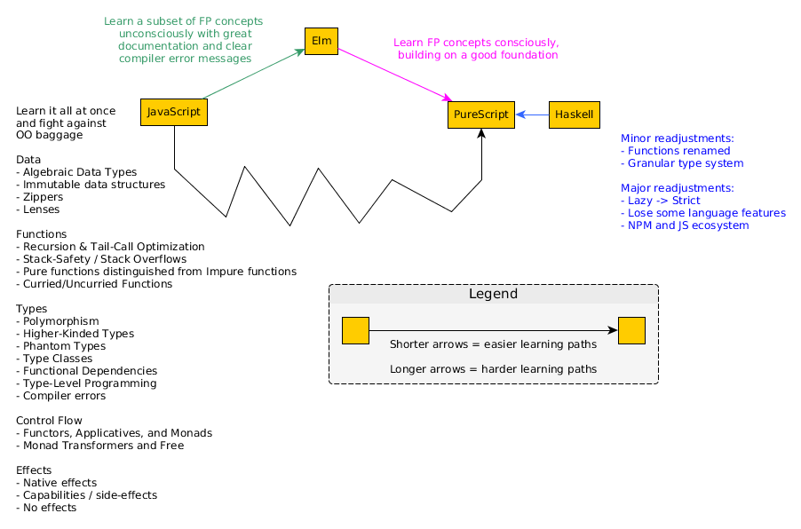

# State of PureScript Documentation: 2019

This document is not meant to convince you to use PureScript, we assume that readers are already interested in it or using it.

It is well-known amongst the PureScript community that its documentation is lacking in some critical areas. As a result, @chexxor started the [PureScript documentation efforts in 2019](https://discourse.purescript.org/t/purescript-documentation-efforts-in-2019/524) Discourse thread to answer one question:
> How can we improve the PureScript documentation in 2019?

(Purpose) The following document tries to do the following things:
1. Provide a researched narrative of PureScript's documentation development and history.
2. Define the types of audiences of PureScript documentation and their expectations.
    - New learners (regardless of language background)
    - PureScript documentation writers
    - Core contributors
3. Summarize the current opinions of PureScript's documentation audiences.
4. Explore strategies for improving PureScript's documentation for its audiences.

<!-- https://imthenachoman.github.io/nGitHubTOC/ -->

- [What is "Good" Documentation Anyway?](#what-is-good-documentation-anyway)
  - [The Types of Documentation](#the-types-of-documentation)
  - [The Documentation's Intended Audience](#the-documentations-intended-audience)
  - [Maintaining Documentation's Accuracy](#maintaining-documentations-accuracy)
    - [The "Size" of a Change](#the-size-of-a-change)
    - [The "Frequency" of a Change](#the-frequency-of-a-change)
    - [How to Make Maintenance Easier](#how-to-make-maintenance-easier)
  - [Criteria for "Good" Documentation](#criteria-for-good-documentation)
  - [Evaluating PureScript's Documentation](#evaluating-purescripts-documentation)
- [Why is PureScript's Documentation Lacking and How Do We Improve It?](#why-is-purescripts-documentation-lacking-and-how-do-we-improve-it)
- [New Learners: What is the Best Way to Learn PureScript?](#new-learners-what-is-the-best-way-to-learn-purescript)
- [PureScript Documentation Writers: What is the Best Way to Write Documentation in this Context?](#purescript-documentation-writers-what-is-the-best-way-to-write-documentation-in-this-context)
- [Core Contributors: ???](#core-contributors-)


## What is "Good" Documentation Anyway?

Did someone ever teach you how to write "good" documentation? Probably not - you likely just wrote what came to mind and hoped it was good enough.

Because of this, it's useful to learn a definition of good documentation and understand why it's defined that way.

Essentially, there are 3 factors that affect whether documentation is "good" or not.
1. Its intended audience
2. Its type: the question being answered, targeting a specific subsection of the audience
3. How accurately it reflects the desired version of the code/project

It's important to note that this section is sourced primarily from two blog posts, [What Nobody Tells You About Documentation](https://www.divio.com/blog/documentation/) and [Teach, Don't Tell](http://stevelosh.com/blog/2013/09/teach-dont-tell/) -- a relatively small number of sources, without even considering the topic of source qualifications. This makes the correctness of this section less certain than others in this document, which makes it more likely to change in significant ways as more information is gathered. Therefore, it would be prudent to define a more "flexible" shape than what's described here when including this in the desired outcomes.

### The Types of Documentation

First, there are 5 types of documentation that target specific phases of a learner's experience (as explained in [What Nobody Tells You About Documentation](https://www.divio.com/blog/documentation/) and [Teach, Don't Tell](http://stevelosh.com/blog/2013/09/teach-dont-tell/))

| Learner's Phase | Type | Analogy | Characteristics
| -- | -- | -- | -- |
| Curious Outsider | The Hook | Selling a product to a potential customer | Answers these questions: <ul><li>What is this thing? / What problem does it solve?</li><li>Why whould I care? / How is this relevant to me for my purposes? / Who should not care?</li><li>How long will it take to learn it and how difficult is the learning curve?</li><li>Where do I go to get started / learn how to use this?</li></ul>
| Potential User | Getting Started | Teaching a child how to cook | <ul><li>Focuses on the learner 'doing' stuff, not 'explaining' stuff to the learner</li><li>Provides a small simple working example that teaches the basics</li><li>New learners experience an 'I can use this now!' moment by the end</li><li>Focuses on concrete tasks, not abstract concepts</li><li>Does not use jargon</li><li>Explains only what is necessary and cuts out all else</li><li>Avoids explaining deeper concepts or different ways of doing the same thing</li></ul>
| New User | How-To Guides | Following a cookbook's recipe | <ul><li>Achieves some goal or solves a problem</li><li>States the pre-requisites one needs to have before starting (not a Getting Started Guide)</li><li>The Guide follows a clearly-labeled step-by-step process</li><li>By following the steps, one reproduces the same results without fail</li><li>Explains the different ways one can achieve the same goal</li><li>Explains only what is necessary</li></ul>
| Active User | Reference | Reading an encyclopedia | <ul><li>Concise explanation of each piece of the code</li><li>The structure of the reference mirrors the structure of the code it documents</li><li>Formatting is consistent throughout the material</li></ul>
| Experienced User | Explanation | Listening to a CEO answer questions about his company | <ul><li>Explains the context/history</li><li>Explains the significant design decisions made, their alternativees, and the reasons one was chosen over another</li><li>Implies where things could be improved, expanded, refined, etc.</li></ul>

Moreover, there are clear examples of "bad" documentation (as explained in [Teach, Don't Tell](http://stevelosh.com/blog/2013/09/teach-dont-tell/)):

| Documentation Source | Why it's bad |
| -- | -- |
| Source Code | Only useful once you are already familiar with it
| Test Code | While it uses the code, it tends to focus on edge cases, not normal cases, and may not use all possible options/configurations.
| API docs | One must know the name of the function/value to be able to read its documentation. Most won't know the name until you teach it to them. Likewise, people don't learn by reading alphabetized lists of disconnected information
| Wiki | Content is usually not written by the code's authors, but by multiple 3rd-party people. There are often multiple disconnected voices throughout the material. It's like asking a student to write his own lesson plan.

### The Documentation's Intended Audience

Second, the number of intended audiences can vary greatly. For example, here are different ways of categorizing them:
- The language/paradigms they primarily use and think in (e.g. JavaScript, Ruby, Haskell; lazy, strict; OO, FP; etc.)
- The amount of experience they have (e.g. never coded before, junior, senior, etc.)
- The programs they are looking to create (e.g. games, financial applications, cryptography, etc.)

Writing documentation that targets JavaScript-background junior developers who want to write games will focus on some things, exclude others, and order its content in a way that makes most sense to that purpose.

As a result, others who read the resulting documentation will consider it "poor" in some aspect:
- If one comes from a non-JavaScript language, one might find references to features in JavaScript confusing: "They used the concept of 'prototypes' to explain something, but that left me even more confused..." ~ a Java developer
- If one comes from a different experience level, one might have unanswered questions: "They didn't even mention what the performance trade-offs for specific libraries were..." ~ a senior developer
- If one has a different goal in mind, some crucial libraries might never be covered: "They didn't explain how I can make my Bitcoin client cryptographically secure..."

### Maintaining Documentation's Accuracy

Third, documentation becomes outdated/inaccurate when the thing being documented changes in two ways:
- the 'size' of a change
- the 'frequency' of changes

#### The "Size" of a Change

The 'size' of a change can decrease its usefulness.

| "Size" | Example
| -- | -- |
| Small | A bug fix that affects little else.
| Medium | A new feature
| Large | One or more breaking changes affecting numerous things simultaneously

When breaking changes occur, documentation can immediately become useless because:
- none of its code examples work anymore
- old terms might mean something different now
- some new parts may need be written
- some parts of the documentation might no longer be relevant
- one needs to figure out how to integrate new content into old content

Updating documentation in light of breaking changes often requires the most work to update.

#### The "Frequency" of a Change

The 'frequency' of a change can decrease its coherence.

| "Frequency" | Example
| -- | -- |
| Rarely | Stable libraries that have exhausted their design space (e.g. core data types)
| Sometimes | Maturing libraries that still have a few things to fix or add
| Frequently | New libraries

When changes occur frequently, documentation can appear more like loosely-coupled snippets of ideas rather than a coherent explanation because:
- Article A depends on Article B to explain something. Then, Article B becomes outdated. Thus, one "patches" Article A with a quick overview of Article B that doesn't fit in with the rest of Article A's content.
- One updates 3 out of 10 articles. One article says `X is true` whereas another says `X is false`. A new learner isn't sure which is correct.

Updating documentation in light of frequent changes often requires less overall work.

#### How to Make Maintenance Easier

Moreover, when breaking changes occur frequently, it discourages people from updating the documentation. Why waste time on something that will become outdated soon?

The nature of this problem is not going to change. So, what medium of documentation provides the most "bang for your buck" long-term that is also is easiest to update?

Heavily-commented code examples.

It follows the principle of "show, don't tell." People can use them as a model from which to learn and as a playground on which to experiment.

Other mediums of documentation (e.g. blog posts, literate programming, videos) each have their place. However, the code examples might produce the easiest-to-update documentation in the shortest time possible.

Lastly, some documentations tasks are tedious and consume lots of time. Finding ways to automate them can greatly improve the situation.

### Criteria for "Good" Documentation

In short, it is impossible to write "good" documentation for everyone that is always up-to-date. There's simply not enough manpower, time, and incentives to do that. Rather, it will be "good", "horrible", or "somewhere in-between" for diffent kinds of people and at different times/seasons.

Still, we can define our criteria for "good" documentation using these four factors. Documentation is "good" when:
- [Type]
    - It states which type of documentation it is
    - It abides by that type's characteristics
- [Audience]
    - It states who the intended audience is
    - For those who aren't the intended audience, it refers to other material that better suits them
- [Accuracy]
    - It tends to be heavier on code examples rather than other mediums
    - It explains which version of the code it documents
        - If it's not the most recent version, it provides:
            - A brief idea of where it is outdated
            - Guidelines for how to understand the outdated explanation in light of new changes
    - It includes the date it was published and when it was last updated
    - It indicates whether it will be updated in the future (and when) or has been abandoned and no future updates will occur.

### Evaluating PureScript's Documentation

Here was PureScript's documentation as of July 2018:

| Name | Type | Audience | Medium |
| -- | -- | -- | -- |
| The Documentation Repository | Getting Started + Explanation | New PS Learners | GitHub Repo
| Pursuit | Reference | All PS developers | API Docs website
| PureScript by Example | Getting Started + How To + Explanation | New PS Learners | Book
| PureScript Resources | Getting Started + Explanation | New PS Learners | Read The Docs
| Lens for the Mere Mortal: PureScript Edition | How To + Explanation | Intermediate PS Learners | Book
| -- | -- | -- | -- |
| Professor Frisby Introduces Composable Functional JavaScript | Getting Started + How to + Explanation | JavaScript developers who want to use JavaScript | Online Course
| An Outsider's Guide to Statically Typed Functional Programming | Hook + Getting Started + How to + Explanation | JavaScript developers who want to learn Elm but are exposed to PureScript at end | Book
| -- | -- | -- | -- |
| Elm to PureScript Cheatsheet | Reference | Elm developers considering PureScript | GitHub Repo
| Differences of PureScript from Elm | Reference | Elm developers consider PureScript (or vice versa) | GitHub Gist
| Documentation Repo's "Differences from Haskell" | Reference | Haskell developers considering PureScript | Markdown file

Here's what has been added to the above since then:

| Name | Type | Audience | Medium |
| -- | -- | -- | -- |
| Real World App | How To Guide? Reference? | PureScript developers | Code Example
| MultiPac | Reference? | PureScript developers | Code Example
| PureScript: Jordan's Reference | Hook + Getting Started + How to + Explanation + Reference | New Learners | GitHub Repo
| A Guide to the PureScript Numeric Hierarchy | Explanation | New Learners | Read the Docs
| Make the Leap from JavaScript to PureScript | Getting Started + Explanation | Javascript developers | Blog Post series

## Why is PureScript's Documentation Lacking and How Do We Improve It?

Here's the short version. Each paragraph will have a link that explains its summary in more detail.

PureScript is not _currently_ trying to be the next "mainstream language." Rather, it values "power" over "popularity" and so works towards those ends. [further explained here]()

While developing the language, core contributors incurred a lot of responsibility (e.g. library maintenance, documentation updates, updating Pursuit and other related sites, etc.). Over time, they became spread thin and one even burned out. [further explained here]()

Thus, they cannot quickly respond to most people's questions or contributions. With the small amount of time they do have, they are focusing on adding new language features, not improving the documentation situation. The language's development is steady (6-week release cycle) but slow. [further explained here]()

However, it seems they are (wisely) postponing "breaking changes" until all can be done at once. Otherwise, they will ~spend~ waste even more of their time updating the ecosystem to account for the breaking changes. There is also some disagreement about when those changes should be done. [further explained here]()

Due to the looming "breaking changes," those who want to improve the documentation situation are often discouraged from improving it. They tend to think, "Why invest many hours into something that will be outdated in a few months? Why not invest those hours into something else, like an interesting project or learning something new?" [further explained here]()

Fixing this situation is not as simple as it sounds. You can't "just delegate" their work to anyone. Others attempted to fund core contributors. However, the effort was likely stopped due to not having a clear idea of how the funds would be spent. [further explained here]()

Moreover, there are other factors independent of the "breaking changes" issues.
1. Until recently (it's fixed now), an OOM error was preventing some popular libraries from uploading their API docs. Even those familiar with the language had difficulty knowing how to use some libraries. [further explained here]()
2. The current support system doesn't build towards structured, persistent documentation. In some ways, it's like trying to get out of quicksand. [further explained here]()

Finally, it is difficult to define what are FP's "best practices / design patterns." This issue won't go away even if all 'breaking changes' have been implemented. [further explained here]()

### PureScript is not _currently_ trying to be the next "mainstream language"

A few have wrongly assumed that PureScript is trying to replace [insert your favorite web language here]. That is not the case.

PureScript has the following philosophy:
> Making a language "popular" (e.g. industry-standard, taught in universities' curriculums, etc.) is not a justification for decreasing its "power," such as limiting the language's expressiveness, making it less safe, less secure, etc.
>
> Making the language easier to use and learn by improving it is good and supported.
> Achieving the same goals by crippling, downgrading, or dumbing down the language is rejected. Users will either learn it properly or use something else.
>
> Plenty of languages chose to sacrifice safety, security, efficiency, etc. to gain the benefits of "popularity."
>
> PureScript will not be another such language. Rather, it will try to progress in "the right way," even when it's inconvenient, makes it harder to learn, etc.
>
> ~ Summary of [A Response that Explains the Motto: 'Avoid (Success at All Costs)'](https://news.ycombinator.com/item?id=12056169) (edits made: replaced 'Haskell' with 'PureScript'; removed "research-related concepts")

While typically stated differently, one could summarize this philosophy as "value power and expressivity over popularity."

The current focus (see later point) is not on making documentation great. Rather, it's on implementing the language features that haven't yet been implemented.

However, even if great documentation was the focus, one will still have to learn difficult concepts before they can be productive. This fact will never change.

Thus, PureScript might not be the language for you:
- If you value 'popularity' over 'power,' use a different language.
- If you value 'power' over 'popularity' and are determined to learn hard things, use this language.

(Related interpretation sections: [Keeping the motto of `Avoid "success at all costs"` and understanding its meaning](https://github.com/chexxor/purescript-documentation-discussion/blob/master/01-Sources-and-Interpretation/All-Interpretations.md#knowing-whom-to-trust-with-write-access-defining-best-workflow-procedures-and-providing-necessary-support))

### Only core contributors have write / deployment privileges to PureScript websites

The following PureScript websites either are outdated or could be modified to improve the documentation situation.

Who can merge PRs into the websites' repositories and redeploy them once these PRs are merged?

| Site | Write Privilege | Deploy Privelege | Source
| -- | -- | -- | -- |
| PureScript language website | Core Contributors | None. GitHub Pages | -
| Pursuit | Core Contributors | Phil Freeman | [The State of Things, point 2](https://discourse.purescript.org/t/the-state-of-things/282)
| Try PureScript | Core Contributors | Phil Freeman | [The State of Things, point 2](https://discourse.purescript.org/t/the-state-of-things/282)

### Core contributors are spread thin

> It’s been 7 months since I announced that I would be taking a long break from PureScript development....
>
> In retrospect, I think it’s fair to say that I was quite thoroughly burned out from trying to balance open source work and real life.
>
> I still love to _use_ PureScript, and I’ve been working to increase PureScript adoption at work....
>
> ~ Phil Freeman, the creator of the PureScript language [(1st & 2nd paragraph)](https://discourse.purescript.org/t/the-state-of-things/282)

The following quote is a response to another's "wallowing:"

> Just to wallow for a second, I...
> - contribute to/review stuff on the compiler
> - attempt to keep on top of the issues, discussions, PRs on roughly 75 libraries (some of which are tiny and almost never change, some of which are purescript-dom :grimacing:)
> - engage with people on Twitter, StackOverflow, Reddit, Slack
> - and very occasionally investigate some idea of my own.
>
> So unless I stop doing some of that, there's no chance I can make any meaningful steps to improving the documentation situation.
>
> ~ Gary Burgess, a core contributor ([2nd paragraph](https://gist.github.com/marick/e8b01375309fafaefb879c4840b6da75#gistcomment-2569261), edits made: content was turned into a list; "..." changed to "," for readability)

After reading such statements, we can only step back and ask,
- Are the core contributors doing ok?
- Are you getting enough rest?
- Are you still investing in meaningful relationships?
- Is contributing to PureScript still enjoyable to you or has it become burdensome?

Thank you for the language you have created, the libraries you wrote and maintain, and all the other things you have done for the benefit of this language and its ecosystem.

Thank you for putting up with frustrating people, enduring negative and impatient attitudes, and trolls.

#### Implications

Reviewing documentation can be just as difficult as reviewing code. Some people are faster at reviewing things than others.

Thus, maintaining momentum when documenting code is difficult:
- Some documentation PRs are missed/forgotten.
- Many do not get a timely response from core contributors (one may wait for weeks)
- Some do not get merged in a timely manner either.

Lastly, I (Jordan) don't know whether some tasks could be automated and whether that would help.

(Related interpretation sections: [Limited Manpower / Not Enough Automation](https://github.com/chexxor/purescript-documentation-discussion/blob/master/01-Sources-and-Interpretation/All-Interpretations.md#limited-manpower--not-enough-automation), [Slow submitted-reviewed-merged timeline of documentation kills momentum](https://github.com/chexxor/purescript-documentation-discussion/blob/master/01-Sources-and-Interpretation/All-Interpretations.md#slow-submitted-reviewed-merged-timeline-of-documentation-prs-kills-documentation-momentum), [Reviewing documentation PRS can be just as difficult as code PRs](https://github.com/chexxor/purescript-documentation-discussion/blob/master/01-Sources-and-Interpretation/All-Interpretations.md#reviewing-documentation-prs-can-be-just-as-difficult-as-code-prs))

#### Why Not Just Delegate?

> A hypothetical developer says, "If it's so much work, why not just **delegate** the work? This 'somebody' can also be a proxy who's gathering feedback, so that you don't have to be in these discussions."
>
> The contributor responds sarcastically, "Oh! Delegation, of course! I hadn't thought about that...."
>
> There's actually an assumption going on here: "If 'free' rice means you can take as much as you want, then 'free' labor implies you can take as much as you want." But that isn't how labor works. If you don't pay for labor, you get less.
>
> Even if everyone could help, there's still limitations due to coordinating efforts: who does what, when, and where, and all without affecting someone else's work.
>
> ~ summary of the 'Why Not Just... Pattern' in [The Hard Parts of Open Source](https://youtu.be/o_4EX4dPppA?t=257)

One shouldn't trust everyone on the internet. (I know, big surprise.)

For example, consider the `event-stream incident`. The maintainer unknowingly gave write-access to a malicious actor. Practically everyone depends on this code. The actor injected code that could be used to steal bitcoins:
- [initial issue](https://github.com/dominictarr/event-stream/issues/116)
- [injected code explanation](https://github.com/dominictarr/event-stream/issues/116#issuecomment-441759047)
- [original maintainer's response](https://github.com/dominictarr/event-stream/issues/116)
- [a sarcastic blog post summarizing this class of attack](https://hackernoon.com/im-harvesting-credit-card-numbers-and-passwords-from-your-site-here-s-how-9a8cb347c5b5)

New maintainers, once found and properly screened, have to be supported (which takes time and thought), so that they can actually fulfill their role. If they decide to leave soon after starting, then one has wasted time and effort.

(Related interpretation sections: [Knowing whom to trust with write access, defining best workflow procedures, and providing necessary support](https://github.com/chexxor/purescript-documentation-discussion/blob/master/01-Sources-and-Interpretation/All-Interpretations.md#knowing-whom-to-trust-with-write-access-defining-best-workflow-procedures-and-providing-necessary-support))

#### Why Not Just Fund the Language Developers?

Been there, done that. Someone took it down. ([PureScript Open Collective]((https://opencollective.com/purescript))

Our viewpoint of this situation:
- Fans of PureScript wanted to throw money at the project. Why? Perhaps because
    - they want to help the project and its goals
    - they dont have the time or mental capacity to contribute
- Several people used OpenCollective to indicate they'd like to pledge money to the "github.com/purescript/purescript" project.
- Several weeks later, someone claimed that project's corresponding OpenCollective page and turned off the public page.
- We believe this was because there was no clear vision as to how the funds would be spent.

Perhaps this idea could be revisited in the future. For now, we cannot say.

### Breaking Changes Outdate Documentation and Kill Documenters' Motivation

The main 'go-to' documentation resource for PureScript was/is [PureScript By Example](https://leanpub.com/purescript/) by Phil Freeman. This resource documents the `0.11.7` PureScript release. The current PureScript release is `0.12.3` (as of this writing).

The `0.12.0` was a significant achievement but one that came with a lot of breaking changes. Phil responded to it in this way:

> [The PureScript by Example book] seems to take longer [to update] with each major compiler update, and honestly, I’m not motivated to update it again without some sort of guarantee that I won’t have to redo everything again in a few months....
> I would like to write a lot more documentation for PureScript, but I hate the idea that it will become out of date quickly....
> So without some sort of plan for the future of the language, and some idea of what changes are coming (and just as importantly, which aren’t), I’m not likely to write anything, and I wouldn’t be surprised if others avoided writing for the same reason.
>
> ~ Phil Freeman [The State of Things, point 4](https://discourse.purescript.org/t/the-state-of-things/282)

Gary later pointed out that releases with "breaking changes" were occuring less frequently ([source](https://docs.google.com/spreadsheets/d/1MO8siLLSOpkKHJ_eBNRJbipBquFgqlaSS-QSnALDSo8/edit#gid=0)). Still, keep in mind that Phil was likely updating the book each time such a release was made.

(Related interpretation sections: [Breaking Changes Render Documentation Outdated](https://github.com/chexxor/purescript-documentation-discussion/blob/master/01-Sources-and-Interpretation/All-Interpretations.md#breaking-changes-renders-documentation-outdated))

### There Is No Roadmap That Coordinates Efforts

Defining a roadmap is hard. It's easy to...
- ...disagree on which goals should be pursued and which to ignore
- ...disagree on how to word such goals
- ...do nothing and let someone else contribute

Creating a "good" roadmap takes significant time and energy.

PureScript does not currently have such a roadmap. Rather, core contributors seem to have a general direction they are pursuing (see next point).

Therefore:
- Those who could help do not know where help is needed
- Those who would help do not know how they can help

#### Avoiding a `v1.0` PureScript language release

When people announce "Language X is now `1.0`!", it tends to draw a lot of focus and a lot of traffic. People probably think, "Wow! It's now stable enough to be used to write all my programs."

In short, one core contributor believes that many would perceive a `v1.0` release as a `v1.0` ecosystem release. The language could be considered 'good enough' for a `v1.0`. However, the ecosystem is definitely not.

What good is a `v1.0` language, if
- common libraries haven't stabilized yet or are non-existant?
- the ecosystem is incoherent in a number of ways?
- the dependency managers are still unfriendly to users?
- the IDE support is still lacking?

Thus, core contributors might avoid defining a roadmap to prevent people from having a `v1.0` ecosystem connotation.

#### Defining a Language Specification

When should future breaking changes be done: before a `v1.0` or afterwards?

`garyb`, a core contributor, has resisted efforts to define a language specification. Why? Because he wants to add two features that will require breaking changes: "poly-kinds and something that requires qualified constraints." ([The State of Things, 6th paragraph in his comment](https://discourse.purescript.org/t/the-state-of-things/282/5))

If done before a `v1.0`, then the language will likely be stable, documentation will not go out of date, and the ecosystem can flourish.

If done after a `v1.0`, then many libraries and docs will need to be updated, the language's reputation might suffer, and people might be forever turned off to it.

(Related interpretation sections: [Lack of a clearly-defined communit-wide mutually-held vision/goal](https://github.com/chexxor/purescript-documentation-discussion/blob/master/01-Sources-and-Interpretation/All-Interpretations.md#lack-of-a-clearly-defined-community-wide-mutually-held-visiongoal), [Lack of a clearly-defined core-contributor-wide mutually-held language specification](https://github.com/chexxor/purescript-documentation-discussion/blob/master/01-Sources-and-Interpretation/All-Interpretations.md#lack-of-a-clearly-defined-core-contributor-wide-mutually-held-language-specification), [Fear that people will misinterpret at "v1.0" compiler release for a "v1.0" ecosystem release](https://github.com/chexxor/purescript-documentation-discussion/blob/master/01-Sources-and-Interpretation/All-Interpretations.md#fear-that-people-will-misinterpret-a-v10-compiler-release-for-a-v10-ecosystem-release))

### Some libraries cannot publish their docs due to OOM error

From [pulp version runs out of memory (fatal exception) - Issue 351](https://github.com/purescript-contrib/pulp/issues/351):
- Context: Bower is used to produce the "resolutions file" that the compiler expects
    - > The compiler expects a “resolutions file” in a similar format to the output of this problematic bower command. We only need a very small portion of the information produced by that command though; for each dependency, if the bower.json specifies anything other than a version range for it, we need to know so that we can produce a warning about that. Otherwise, we need to know which version bower’s solver picked. If I remember correctly that’s everything. Unfortunately I’m not aware of a more sensible variant of bower list which produces all the information we need. [comment in issue, paragraph 2](https://github.com/purescript-contrib/pulp/issues/351#issuecomment-395611759)
- Problem: Bower throws a `RangeError` when attempting to `JSON.stringify` an object that includes a massive dependency tree due to duplicate transitive dependencies:
    - > Bower builds a log object, which has our dependency tree. When they try to JSON.stringify this object, it throws RangeError: Invalid string length [comment in issue](https://github.com/purescript-contrib/pulp/issues/351#issuecomment-395605607)

The proposed solution: change the compiler's "resolution file" schema. Unfortunately, this is a breaking change (tracking issue: [Simplify `purs publish` resolution format](https://github.com/purescript/purescript/issues/3499)):
    - > To clarify, the course of action I'm suggesting is that we have `pulp` actually look through the filesystem and collect the resolutions data, and we then pass that information to the compiler. It would make our lives easier if we could also change the compiler so that it accepts this information using a more sensible schema than that of `bower list --offline --json` (and this is what I'm suggesting in that issue ([comment in issue](https://github.com/purescript-contrib/pulp/issues/351#issuecomment-450465708))).

Thus, a heavily-used library like `Halogen` cannot publish its `v4.0.0` or `v5.0.0` docs on Pursuit. Unfortunately, there's nothing they can do about it.

### The current support system doesn't build towards structured, persistent documentation

Because the documentation is lacking, many are encouraged to ask their questions on the `#purescript` channel in the FP Slack. Many have greatly benefited from the quick answers they receive.

There are two issues with this approach:
1. Such answers cannot be easily found because they are hidden in a chatroom's length conversation.
2. These questions and their answers do not persist. After so much time, Slack will delete them.

Thus, people with the same already-answered questions can't find their answers. They ask the same questions and receive the same answers. This takes time away from other contributors and developers.

@chexxor has made some effort to address these issues by cross-posting such discussions in the Discourse forum. This accounts for the second issue.

However, the format is poor. One must read through a (sometimes) lengthy conversation to find the answer.
Contrast that with an StackOverflow question and answer that appears in a Google search.

(Related interpretation section: [PureScript's Mediums of Communication](https://github.com/chexxor/purescript-documentation-discussion/blob/master/01-Sources-and-Interpretation/All-Interpretations.md#purescripts-mediums-of-communication))

### What Exactly are FP's "Best Practices"

Coming from an Object-Oriented Paradigm, some have asked, "Why aren't the best practices / design patterns / idioms in Functional Programming explained/documented?"

What are FP's "design patterns" / "idioms" / "best practices" ? How would you define them?

FP's "best practices" are
- hard to define
    - Are `monads` a design pattern?
    - Are `lenses` a design pattern?
    - What is not a design pattern?
- things people assume everyone does (so why explain them?)
    - Functions compose. Didn't people realize that type class X and Y are often used together?
    - I used a recursive data type to model a domain. How else would I model it?
- unconscious habits ("Oh! I didn't realize this was a 'design pattern.'")
    - I used a List zipper to efficiently update an item in the list. What else would I use?

FP languages tend to draw people who are intellectually curious. These people tend not to be good at explaining FP's benefits and concepts. Knowledge get stuck in "silos."

(Related interpretation section: [FP "best practices" are not well-defined, are assumed, or are unconscious habits](https://github.com/chexxor/purescript-documentation-discussion/blob/master/01-Sources-and-Interpretation/All-Interpretations.md#fp-best-practices-are-not-well-defined-are-assumed-or-are-unconscious-habits), [FP's culture creates "knowledge silos"](https://github.com/chexxor/purescript-documentation-discussion/blob/master/01-Sources-and-Interpretation/All-Interpretations.md#fps-culture-creates-knowledge-silos))

### But Is There Hope? Yes!

This small change will address the FP Slack persistence issue:
- When a question on the `#purescript` Slack channel gets answered, request the person who asked it to post the question on StackOverflow and link to the question in the chatroom.
- Then, let someone (whether the answerer or someone who saw it) "answer" that question and give credit it to the answerer.

People are making an assumption that has not been tested. **Are all documentation efforts always affected by a breaking change?** I doubt it. Certainly there are some things that need better documentation which won't be affected by breaking changes. Why not identify what those are and start improving them?

Such efforts will likely need to be "unofficial." We (non-core-contributors / users of PS) do not want to steal time away from the core contributors by distracting them with documentation PRs. Let them focus on the language's development. Stabilizing the language sooner means an improved documentation situation sooner.

Rather, we (non-core-contributors / users of PS) can focus on answering questions like these:
- What are the libraries that need to have their documentation improved?
    - If documented, will breaking changes outdate such documentation?
    - How hard would it be to write a small code example that shows how to use them? For example
        - [Jordan's example for how to create a tree via `purescript-tree`](https://github.com/JordanMartinez/purescript-jordans-reference/blob/latestRelease/22-Projects/src/11-Table-of-Contents/04-Tree/01-Syntax.purs#L31-L64)
        - [Jordan's example of the "hello world" program via the ReaderT design pattern](https://github.com/JordanMartinez/purescript-jordans-reference/blob/latestRelease/21-Hello-World/08-Application-Structure/src/11-Hello-World/02-ReaderT.purs)
        - [Halogen's "basic button component" example](https://github.com/slamdata/purescript-halogen/blob/master/examples/basic/src/Button.purs)
- What are "best practices" for various topics/areas? For example:
    - Guidelines for writing a good bindings library
        - How should a library author analyze the library to which they want to write bindings?
        - What are common problems such people face and their possible solutions?
- What are some of the clearest explanations of FP concepts?
    - How hard is it to port their code examples to PureScript?
    - Have people written an explanation that "walks one through" an FP paper's ideas in a clear way?
- What are common solutions to build-related problems? Where is a centralized resource that can store all of these?
    - Integrating PureScript to work with JS build tools?
    - Integrating PureScript with CI (Travis, AppVeyor, etc.)?
    - Possible "tree-shaking" approaches to PureScript and their tradeoffs?

## New Learners: What is the Best Way to Learn PureScript?

First, PureScript is mainly used for front-end work, not back-end work. While it is used for the back-end in some situations, most tend to use Haskell or another language, even if PureScript would be a better language in some situations. These languages already have mature libraries with people maintaining them. So, the incentives to improve this situation are not quite there.

Second, your language background affects how easy or hard it is to learn PureScript. There are likely other learning paths besides the ones covered below, but here's what we found in our research:



| If your language background is... | ... then try these learning resources... | ... and these PureScript libraries |
| -- | -- | -- |
| JavaScript / OO languages | [Make the Leap from JavaScript to PureScript (Tutorial Series)](https://medium.com/@kelleyalex/index-make-the-leap-from-javascript-to-purescript-a1566d657e9c)<br><br>[An Outsider's Guide to Statically Typed Functional Programming (Book)](https://leanpub.com/outsidefp)<br><br>[Haskell: From First Principles](http://haskellbook.com/) | --
| Elm | [An Outsider's Guide to Statically Typed Functional Programming (Book)](https://leanpub.com/outsidefp) | --
| Haskell | [Introduction to PureScript (PDF)](http://code.adriansieber.com/adrian/adriansieber-com/src/branch/master/posts/_2018-11-01_introduction_to_purescript_for_haskell_developers/main.pdf)<br><br>[Differences from Haskell](https://github.com/purescript/documentation/blob/master/language/Differences-from-Haskell.md) | --

## PureScript Documentation Writers: What is the Best Way to Write Documentation in this Context?

## Core Contributors: ???

Please answer the below questions.

To help with consistency, copy the below questions and paste them into your comment box. Then, give a reply.
```
> What can the community do to encourage/support you in 2019?


> What are your general goals for the language/ecosystem in 2019?


> What are not your goals for the language/ecosystem in 2019? (i.e. things you know need additional work, but just don't have a high enough priority right now)


> What processes that are not automated could be automated to save you time / lower the maintenance cost?


> What kind of help do you want from the community in 2019 (e.g. maintainership, documentation, conbtributions, etc.)?


> What kind of help do you not want from the community in 2019 (e.g. maintainership, documentation, conbtributions, etc.)?


> How much support are you willing to provide to those who want to help and in what form?

```


The following
    - Evaluate PureScript's documentation using that criteria
    - Explain why PureScript's documentation is lacking and what is being done to improve it
    - Address various audience's possible concerns or questions centered on these themes:
        - New learners - How should I learn PureScript?
        - PureScript documentation writers - How should I write good maintainable documentation for others?
        - Core Contributors -

A few different audiences
- shared (things we should explain, no matter who reads this)
    - Why read this document (capture people's attention in less than 2 paragraphs)
    - What is good documentation for new learners? (defining our terminology and criteria)
    - How does PureScript fair in that regard? (use that criteria to judge PS' current documentation)
    - Why isn't it better? (explain the obstacles that prevent it from being better)
- new learners (address things new learners care about)
    - What should your expectations be when learning? (frustration arises when expectations are broken)
    - How are people currently trying to improve it? (explain current efforts that people can tag alongside of / help / give feedback on)
    - How can you help in this effort? (you are most motivated, so you'll drive the effort or help out in some situations)
- Documentation writers (address things they care about)
    - How do I write good documentation for new learners?
    - How do I write documentation that does not go out-of-date quickly?
    - How do I write maintainable documentation?
    - How should I bring awareness to my documentation efforts?
- PS core contributors (things they care about)
    - What processes could be automated to save you time / lower the maintenance cost?
    - Questions whose answers would be helpful for others to know
        - What 'qualifications', if any, would they prefer someone has before delegating a project to them?

Here's a quick overview of some of its benefits compared to other languages:
- PureScript provides certain guarantees by default that other web languages do not or cannot (e.g. JavaScript, TypeScript)
- PureScript is more powerful than similar alternatives (i.e. Elm)
- PureScript can be used to 'patch' existing code, enabling one to slowly migrate a large application to PureScript one component at a time (unlike Haskell's GHCJS).
