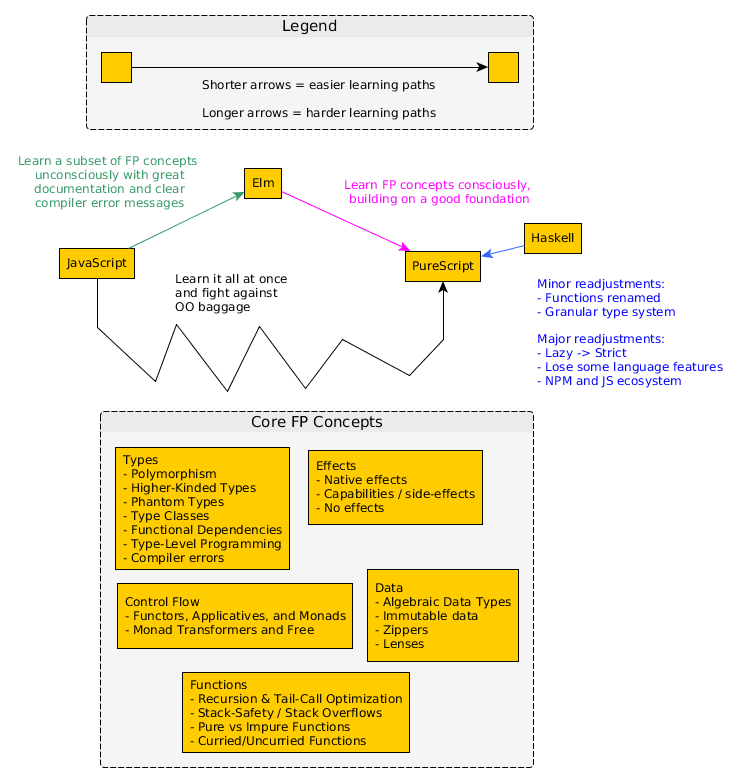

# State of PureScript Documentation: 2019

## Why Read This Document?

This document is not meant to convince you to use PureScript. We assume that readers already believe in using PureScript instead of alternatives.

It is well-known among the PureScript community that its documentation is lacking in some critical areas. As a result, @chexxor started the [PureScript documentation efforts in 2019](https://discourse.purescript.org/t/purescript-documentation-efforts-in-2019/524) discourse thread to answer one question:
> How can we improve the PureScript documentation in 2019?

(Purpose) The following document tries to do two things:
1. Provide an answer to @chexxor's above question
2. Answer other related questions that various audiences will have:
    - new learners (regardless of language background)
    - PureScript documentation writers
    - Core Contributors

Outline
- Explain what "good" documentation is and define a criteria
- Evaluate PureScript's documentation using that criteria
- Explain why PureScript's documentation is seen as lacking
- Suggest plans to improve the current documentation situation
- Address various audience's possible concerns or questions centered on these themes:
    - New learners - How should I learn PureScript?
    - PureScript documentation writers - How should I write good maintainable documentation for others?
    - Core Contributors -

## What is "Good" Documentation Anyway?

Did someone ever teach you how to write "good" documentation? Probably not - you likely just wrote what came to mind and hoped it was good enough.

Because of this, it's useful to learn a definition of good documentation and understand why it's defined that way.

Essentially, there are 3 factors that affect whether documentation is "good" or not.
1. Its intended audience
2. Its type: the question being answered, targeting a specific subsection of the audience
3. How accurately it reflects the desired version of the code/project

### The Types of Documentation

First, there are 5 types of documentation that target specific phases of a learner's experience (as explained in [What Nobody Tells You About Documentation](https://www.divio.com/blog/documentation/) and [Teach, Don't Tell](http://stevelosh.com/blog/2013/09/teach-dont-tell/))

| Learner's Phase | Type | Analogy | Characteristics
| -- | -- | -- | -- |
| Curious Outsider | The Hook | Selling a product to a potential customer | Answers these questions: <ul><li>What is this thing? / What problem does it solve?</li><li>Why whould I care? / How is this relevant to me for my purposes? / Who should not care?</li><li>How long will it take to learn it and how difficult is the learning curve?</li><li>Where do I go to get started / learn how to use this?</li></ul>
| Potential User | Getting Started | Teaching a child how to cook | <ul><li>Focuses on the learner 'doing' stuff, not 'explaining' stuff to the learner</li><li>Provides a small simple working example that teaches the basics</li><li>New learners experience an 'I can use this now!' moment by the end</li><li>Focuses on concrete tasks, not abstract concepts</li><li>Does not use jargon</li><li>Explains only what is necessary and cuts out all else</li><li>Avoids explaining deeper concepts or different ways of doing the same thing</li></ul>
| New User | How-To Guides | Following a cookbook's recipe | <ul><li>Achieves some goal or solves a problem</li><li>States the pre-requisites one needs to have before starting (not a Getting Started Guide)</li><li>The Guide follows a clearly-labeled step-by-step process</li><li>By following the steps, one reproduces the same results without fail</li><li>Explains the different ways one can achieve the same goal</li><li>Explains only what is necessary</li></ul>
| Active User | Reference | Reading an encyclopedia | <ul><li>Concise explanation of each piece of the code</li><li>The structure of the reference mirrors the structure of the code it documents</li><li>Formatting is consistent throughout the material</li></ul>
| Experienced User | Explanation | Listening to a CEO answer questions about his company | <ul><li>Explains the context/history</li><li>Explains the significant design decisions made, their alternativees, and the reasons one was chosen over another</li><li>Implies where things could be improved, expanded, refined, etc.</li></ul>

Moreover, there are clear examples of "bad" documentation (as explained in [Teach, Don't Tell](http://stevelosh.com/blog/2013/09/teach-dont-tell/)):

| Documentation Source | Why it's bad |
| -- | -- |
| Source Code | Only useful once you are already familiar with it
| Test Code | While it uses the code, it tends to focus on edge cases, not normal cases, and may not use all possible options/configurations.
| API docs | One must know the name of the function/value to be able to read its documentation. Most won't know the name until you teach it to them. Likewise, people don't learn by reading alphabetized lists of disconnected information
| Wiki | Content is usually not written by the code's authors, but by multiple 3rd-party people. There are often multiple disconnected voices throughout the material. It's like asking a student to write his own lesson plan.

### The Documentation's Intended Audience

Second, the number of intended audiences can vary greatly. For example, here are different ways of categorizing them:
- The language/paradigms they primarily use and think in (e.g. JavaScript, Ruby, Haskell; lazy, strict; OO, FP; etc.)
- The amount of experience they have (e.g. never coded before, junior, senior, etc.)
- The programs they are looking to create (e.g. games, financial applications, cryptography, etc.)

Writing documentation that targets JavaScript-background junior developers who want to write games will focus on some things, exclude others, and order its content in a way that makes most sense to that purpose.

As a result, others who read the resulting documentation will consider it "poor" in some aspect:
- If one comes from a non-JavaScript language, one might find references to features in JavaScript confusing: "They used the concept of 'prototypes' to explain something, but that left me even more confused..." ~ a Java developer
- If one comes from a different experience level, one might have unanswered questions: "They didn't even mention what the performance trade-offs for specific libraries were..." ~ a senior developer
- If one has a different goal in mind, some crucial libraries might never be covered: "They didn't explain how I can make my Bitcoin client cryptographically secure..."

### Maintaining Documentation's Accuracy

Third, documentation becomes outdated/inaccurate due to changes, especially breaking changes. It does this in two ways: decreasing its usefulness (depends on the 'size' of a change) and decreasing its coherence (depends on the 'frequency' of changes).

#### The "Size" of a Change

| "Size" | Example
| -- | -- |
| Small | A bug fix that affects little else.
| Medium | A new feature
| Large | One or more breaking changes affecting numerous things simultaneously

When breaking changes occur, documentation can immediately become useless because:
- none of its code examples work anymore
- old terms might mean something different now
- some new parts may need be written
- some parts of the documentation might no longer be relevant
- one needs to figure out how to integrate new content into old content

Updating documentation in light of breaking changes often requires the most work to update.

#### The "Frequency" of a Change

| "Frequency" | Example
| -- | -- |
| Rarely | Stable libraries that have exhausted their design space (e.g. core data types)
| Sometimes | Maturing libraries that still have a few things to fix or add
| Frequently | New libraries

When changes occur frequently, documentation can appear more like loosely-coupled snippets of ideas rather than a coherent explanation because:
- Article A depends on Article B to explain something. Then, Aritcle B becomes outdated. Thus, one "patches" Article A with a quick overview of Article B that doesn't fit in with the rest of Article A's content.
- One updates 3 out of 10 articles. One article says `X is true` whereas another says `X is false`. A new learner isn't sure which is correct.

Updating documentation in light of frequent changes often requires less overall work.

#### How to Make Maintenance Easier

Moreover, when breaking changes occur frequently, it discourages people from updating the documentation. Why waste time on something that will become outdated soon?

The nature of this problem is not going to change. So, what medium of documentation provides the most "bang for your buck" long-term that is also is easiest to update?

Heavily-commented code examples.

It follows the principle of "show, don't tell." People can use them as a model from which to learn and as a playground on which to experiment.

Other mediums of documentation (e.g. blog posts, literate programming, videos) each have their place. However, the code examples might produce the easiest-to-update documentation in the shortest time possible.

Lastly, some documentations tasks are tedious and consume lots of time. Finding ways to automate them can greatly improve the situation.

### Criteria for "Good" Documentation

In short, it is impossible to write "good" documentation for everyone that is always up-to-date. There's simply not enough manpower, time, and incentives to do that. Rather, it will be "good", "horrible", or "somewhere in-between" for diffent kinds of people and at different times/seasons.

Still, we can define our criteria for "good" documentation using these four factors. Documentation is "good" when:
- [Type]
    - It states which type of documentation it is
    - It abides by that type's characteristics
- [Audience]
    - It states who the intended audience is
    - For those who aren't the intended audience, it refers to other material that better suits them
- [Accuracy]
    - It tends to be heavier on code examples rather than other mediums
    - It explains which version of the code it documents
        - If it's not the most recent version, it provides:
            - A brief idea of where it is outdated
            - Guidelines for how to understand the outdated explanation in light of new changes
    - It includes the date it was published and when it was last updated
    - It indicates whether it will be updated in the future (and when) or has been abandoned and no future updates will occur.

### Evaluating PureScript's Documentation

Here was PureScript's documentation as of July 2018:

| Name | Type | Audience | Medium |
| -- | -- | -- | -- |
| The Documentation Repository | Getting Started + Explanation | New PS Learners | GitHub Repo
| Pursuit | Reference | All PS developers | API Docs website
| PureScript by Example | Getting Started + How To + Explanation | New PS Learners | Book
| PureScript Resources | Getting Started + Explanation | New PS Learners | Read The Docs
| Lens for the Mere Mortal: PureScript Edition | How To + Explanation | Intermediate PS Learners | Book
| -- | -- | -- | -- |
| Professor Frisby Introduces Composable Functional JavaScript | Getting Started + How to + Explanation | JavaScript developers who want to use JavaScript | Online Course
| An Outsider's Guide to Statically Typed Functional Programming | Hook + Getting Started + How to + Explanation | JavaScript developers who want to learn Elm but are exposed to PureScript at end | Book
| -- | -- | -- | -- |
| Elm to PureScript Cheatsheet | Reference | Elm developers considering PureScript | GitHub Repo
| Differences of PureScript from Elm | Reference | Elm developers consider PureScript (or vice versa) | GitHub Gist
| Documentation Repo's "Differences from Haskell" | Reference | Haskell developers considering PureScript | Markdown file

Here's what has been added to the above since then:

| Name | Type | Audience | Medium |
| -- | -- | -- | -- |
| Real World App | How To Guide? Reference? | PureScript developers | Code Example
| MultiPac | Reference? | PureScript developers | Code Example
| PureScript: Jordan's Reference | Hook + Getting Started + How to + Explanation + Reference | New Learners | GitHub Repo
| A Guide to the PureScript Numeric Hierarchy | Explanation | New Learners | Read the Docs
| Make the Leap from JavaScript to PureScript | Getting Started + Explanation | Javascript developers | Blog Post series

## Why is PureScript's Documentation Lacking and How Do We Improve It?

- Philosophy of the language:
    - avoid (success at all costs)
    - wrong intepretation:
    - right interpretation
- Current priority of core contributors: adding powerful features via breaking changes
    - wrong interpretation: they don't care
    - right interpretation: want to improve language
    - Why a `v1.0` hasn't been released
- Core Contributors are spread thin, so they cannot respond quickly to things
    - The '75 libraries' problem
    - Entrusting library maintenance to others and supporting them (e.g. the `event-stream` incident)
    - Just like reviewing code, reviewing documentation takes a lot of thought
    - Hard to keep documentation momentum
    - Which libraries are 'core libraries'?
- No clearly-defined mutually-held community-wide goal
    - A desire to help exists, but no one is coordinating resources strategically
- What exactly are FP's "Best Practices?"
    - They are not well-defined, are assumed, or are habits
    - Knowledge silos exist, so it's hard to extract that info
- Slack-based discussions do not persist

## New Learners: What is the Best Way to Learn PureScript?

There are likely other learning paths besides the ones covered below, but here's what we found in our research:

## PureScript Documentation Writers: What is the Best Way to Write Documentation in this Context?

## Core Contributors: ???

The following
    - Evaluate PureScript's documentation using that criteria
    - Explain why PureScript's documentation is lacking and what is being done to improve it
    - Address various audience's possible concerns or questions centered on these themes:
        - New learners - How should I learn PureScript?
        - PureScript documentation writers - How should I write good maintainable documentation for others?
        - Core Contributors -

A few different audiences
- shared (things we should explain, no matter who reads this)
    - Why read this document (capture people's attention in less than 2 paragraphs)
    - What is good documentation for new learners? (defining our terminology and criteria)
    - How does PureScript fair in that regard? (use that criteria to judge PS' current documentation)
    - Why isn't it better? (explain the obstacles that prevent it from being better)
- new learners (address things new learners care about)
    - What should your expectations be when learning? (frustration arises when expectations are broken)
    - How are people currently trying to improve it? (explain current efforts that people can tag alongside of / help / give feedback on)
    - How can you help in this effort? (you are most motivated, so you'll drive the effort or help out in some situations)
- Documentation writers (address things they care about)
    - How do I write good documentation for new learners?
    - How do I write documentation that does not go out-of-date quickly?
    - How do I write maintainable documentation?
    - How should I bring awareness to my documentation efforts?
- PS core contributors (things they care about)
    - What processes could be automated to save you time / lower the maintenance cost?
    - Questions whose answers would be helpful for others to know
        - What 'qualifications', if any, would they prefer someone has before delegating a project to them?

Here's a quick overview of some of its benefits compared to other languages:
- PureScript provides certain guarantees by default that other web languages do not or cannot (e.g. JavaScript, TypeScript)
- PureScript is more powerful than similar alternatives (i.e. Elm)
- PureScript can be used to 'patch' existing code, enabling one to slowly migrate a large application to PureScript one component at a time (unlike Haskell's GHCJS).
